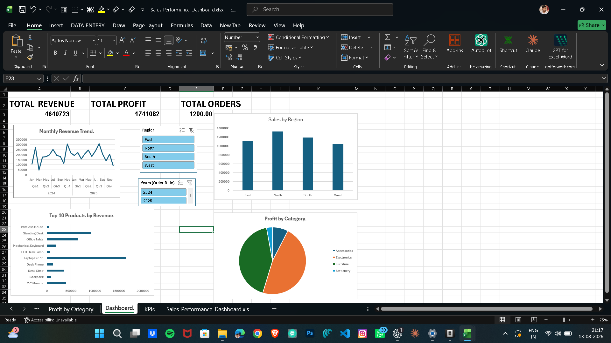

# Sales Performance Dashboard

## Overview

A Microsoft Excel dashboard designed to analyze sales performance and provide clear business insights through interactive visualizations. Built with PivotTables, PivotCharts, and slicers, it lets users explore revenue, profit, orders, regional performance, product performance, and category profitability from a single view.

## Dashboard Features

- **KPI cards** — Total Revenue, Total Profit, and Total Orders
- **Monthly Revenue Trend** — month-over-month revenue movement
- **Sales by Region** — regional performance breakdown
- **Top 10 Products by Revenue** — highest-grossing products
- **Profit by Category** — profitability across product categories
- **Region slicer** — filter all visuals by geographic region
- **Year slicer** — filter all visuals by year

## Tools & Techniques

- Microsoft Excel
- PivotTables
- PivotCharts
- Slicers
- Data Analysis
- Data Visualization

## Key Insights

The dashboard enables a user to:

- Monitor headline business performance at a glance via the KPI cards (Total Revenue, Total Profit, Total Orders — 607,092 / 228,943 / 168 as shown on the dashboard).
- Identify revenue seasonality and trends from the monthly revenue trend chart.
- Compare sales contribution and performance across regions.
- Pinpoint the top-performing products and evaluate category-level profitability.
- Use the Region and Year slicers to dynamically filter every chart and KPI for focused analysis.

## Files

| File | Purpose |
| ---- | ------- |
| `Sales_Performance_Dashboard.xlsx` | The interactive Excel workbook containing the data, PivotTables, PivotCharts, and slicers |
| `dashboard-preview.png` | Screenshot of the finished dashboard |

## How to Use

1. Download `Sales_Performance_Dashboard.xlsx`.
2. Open it in Microsoft Excel (2016 or later, desktop recommended for full interactivity).
3. Use the Region and Year slicers to filter the dashboard — all charts and KPI cards update instantly.
